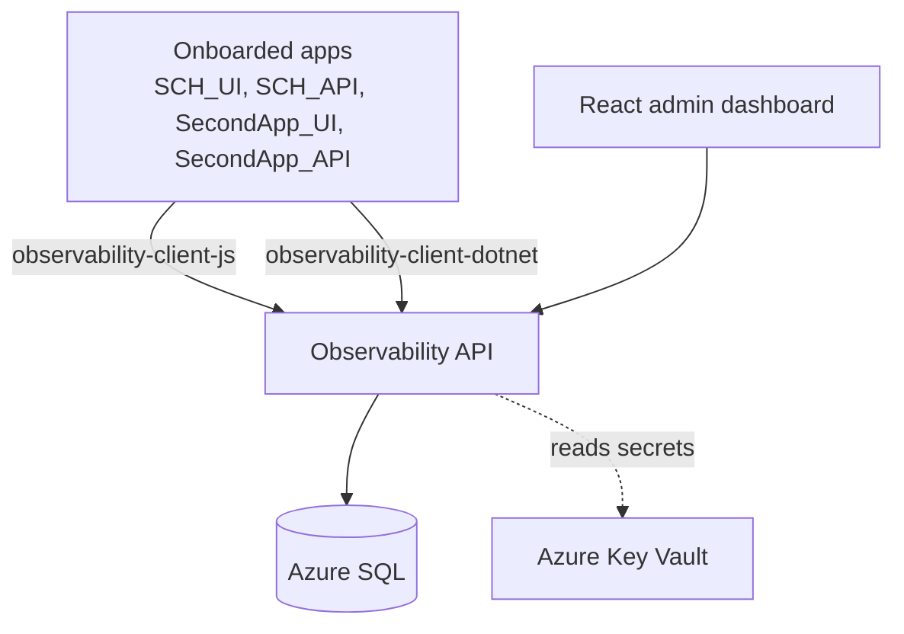

# Architecture

## Overview

`adaptive-observability` is an internal platform that ingests safe events and errors from onboarded apps' frontend and backend SDKs, persists them in Azure SQL, and surfaces them in a React admin dashboard.

It replaces an already-shipped PostHog Phase 1 integration in SCH. Contracts (event names, identity rules, allowed property shapes, route normalization) are preserved verbatim from `POSTHOG_EVENT_CATALOG.md` so SCH migration is mechanical.

## Components

## Ingestion path

1. SDK collects a safe event/error (allowlist already enforced client-side as a soft check).
2. SDK sends to `POST /api/ingest/events` or `POST /api/ingest/errors` with `X-Observability-Key` header.
3. Auth middleware resolves the API key hash → `Application` + `AppEnvironment` + `KeyType`.
4. Correlation ID middleware accepts incoming `X-Correlation-Id` or generates a ULID.
5. Allowlist validator drops unknown property keys; rejects known-forbidden keys with a `SafetyViolations` row.
6. Persisted to `Events` or `Errors`. Errors are fingerprinted; repeats increment `OccurrenceCount`.
7. 202 Accepted returned.

## Dashboard path

1. React app authenticates (Phase 8 RBAC; placeholder login for MVP).
2. Filter bar selects `Application` + `AppEnvironment` + date range.
3. Pages call `/api/dashboard/*` and `/api/sessions/*` server-side queries.
4. Recharts renders sparklines. CSV export available on event explorer.

## Onboarding path

1. Admin opens dashboard `Admin > Apps`.
2. Registers `Application` (slug, name) and per-environment config (`Development`, `UAT`, `Production`).
3. Generates two keys per environment: `public_client` (FE) and `server_api` (BE). Plaintext shown once.
4. App owner installs SDK, sets `init({ host, key, environment, releaseSha })`, deploys.

## Deployment topology

| Env  | App Service                         | SQL                  | Key Vault                  |
|------|-------------------------------------|----------------------|----------------------------|
| Dev  | local docker-compose / `app-obs-dev`| docker mssql / Az SQL| `kv-observability-dev`     |
| UAT  | `app-obs-uat`                       | Az SQL UAT           | `kv-observability-uat`     |
| Prod | `app-obs-prod`                      | Az SQL Prod          | `kv-observability-prod`    |

Managed identity per App Service, scoped read on its same-environment Key Vault.

## Migration from PostHog (summary)

- SCH_API DI registration swaps `PostHogService` → `AdaptiveObservabilityService` (both implement `IAnalyticsService`).
- SCH_UI swaps `posthog.*` calls in `analytics.ts` for `observability-client-js` calls. API surfaces match.
- 5-business-day dual-write window in UAT validates parity.
- See `docs/migration/posthog-to-adaptive.md` (Phase 6).

## Session timeline (Phase 5)

**Decision (Issue 5.2): derived for MVP.** The `GET /api/sessions/{sessionId}/timeline` endpoint reconstructs the timeline at request time from `Events` + `Errors` joined by `(SessionId, OccurredAt)` and a secondary join on `CorrelationId` for cross-process backend errors. Rationale:

- Existing `Events` rows already index `(ApplicationId, EnvironmentId, CreatedAt)` plus `(ApplicationId, EventName, CreatedAt)`. Adding `(SessionId)` to support derived queries is cheap; a materialized `SessionEvents` table would duplicate rows already on disk.
- A 1M-event synthetic dataset comfortably returns single-session timelines under 50ms with the planned indexes; sessions are rarely > a few hundred events.
- Materialization buys denormalized scrolling for very long replay timelines (Phase 9), not for dashboards. Revisit when replay metadata pushes per-session entry counts past ~10k.

The endpoint also surfaces backend errors that share a `CorrelationId` with a FE event in the session — even when those errors have no `SessionId` of their own (e.g. server-side `server_error_occurred`). Each error entry is tagged `source: "in_session" | "cross_process"` so the UI can style them differently.

## Error fingerprinting (Issue 8.1)

Errors are grouped server-side by a **fingerprint** — a stable hash of the failure's shape — so that
repeats collapse onto a single `Errors` row whose `OccurrenceCount` is incremented rather than
spawning a new row per occurrence. The algorithm lives in one place: `ErrorFingerprint.Compute`
(`Observability.Application/Ingestion/ErrorFingerprint.cs`).

**Inputs (in order, pipe-joined):** `error_type | exception_type | endpoint_group | job_name`.
Nulls are normalized to empty strings so the delimited shape is fixed. Volatile fields —
`correlation_id`, `release_sha`, timestamps, `http_status_code`, `normalized_route` — are
deliberately **excluded** so the same fault groups together across requests and releases.

**Hash:** SHA-256 of the UTF-8 input, truncated to the first 32 hex chars (128 bits). This fits the
64-char `Fingerprint` column with headroom; 128 bits is collision-resistant for the cardinality of
distinct error shapes a single tenant produces.

**Dedup key:** the unique index `(ApplicationId, EnvironmentId, Fingerprint)` enforces one row per
distinct fault per tenant/environment. The upsert (`IngestionStore.UpsertErrorAsync`) bumps
`OccurrenceCount` and advances `LastSeenAt` / `LastCorrelationId` on a hit.

**Versioning & backfill.** Every row records the algorithm version that produced it in
`FingerprintVersion`, sourced from the `ErrorFingerprint.CurrentVersion` constant (currently `1`).
To evolve the algorithm, change `Compute` and increment `CurrentVersion` in the same change, then run
the backfill: `POST /api/admin/fingerprints/backfill` (admin-key gated). The backfiller
(`IErrorFingerprintBackfiller`) re-stamps every row below the current version, and when a recompute
moves a row onto a fingerprint another row already owns, it **merges** them — summing
`OccurrenceCount` and widening the first/last-seen bounds — so the unique index holds and no
occurrence history is lost. The operation is idempotent and writes an `admin.fingerprint.backfilled`
audit row.

## Open architectural questions

- **Ingestion queue** — in-process `Channel<T>` for MVP (Phase 1), Service Bus when RPS warrants (Phase 8.9).
- **Event-catalog source of truth** — leaning code (compile-time SDK safety) with a generated markdown view; final decision pending.
