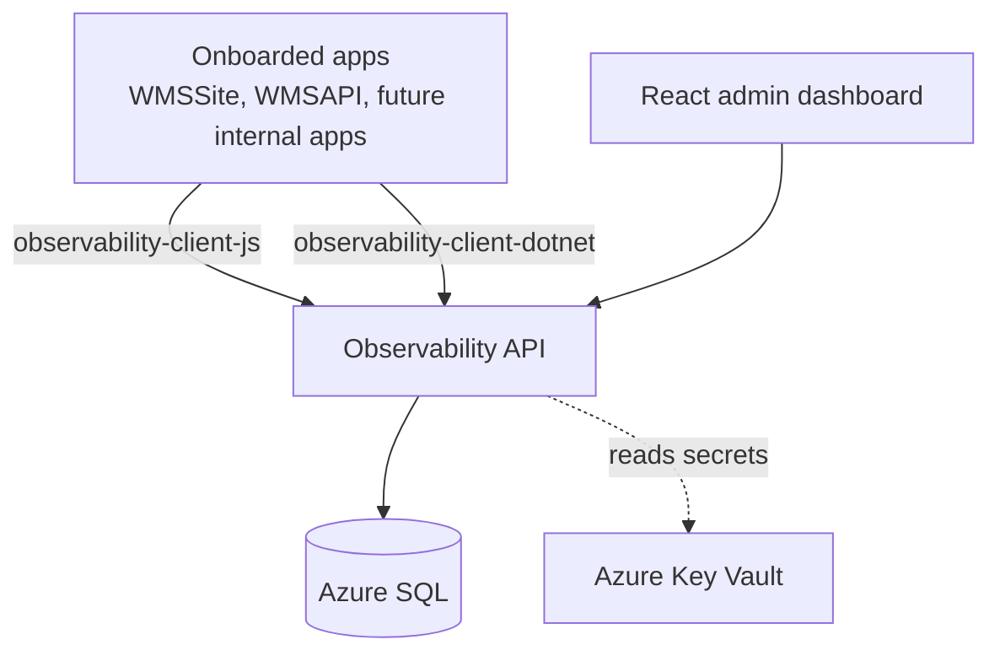

# Architecture

## Overview

`adaptive-observability` is an internal platform that ingests safe events and errors from onboarded apps' frontend and backend SDKs, persists them in Azure SQL, and surfaces them in a React admin dashboard.

Its first tenant is the Wound Management System (WMSSite + WMSAPI), which instruments net-new against the SDKs. Contracts (event names, identity rules, allowed property shapes, route normalization) trace their shape to the original `POSTHOG_EVENT_CATALOG.md`, which keeps onboarding mechanical and consistent across tenants.

## Components

## Ingestion path

1. SDK collects a safe event/error (allowlist already enforced client-side as a soft check).
2. SDK sends to `POST /api/ingest/events` or `POST /api/ingest/errors` with `X-Observability-Key` header.
3. Auth middleware resolves the API key hash → `Application` + `AppEnvironment` + `KeyType`.
4. Correlation ID middleware accepts incoming `X-Correlation-Id` or generates a ULID.
5. Allowlist validator drops unknown property keys; rejects known-forbidden keys with a `SafetyViolations` row.
6. Persisted to `Events` or `Errors`. Errors are fingerprinted; repeats increment `OccurrenceCount`.
7. 202 Accepted returned.

## Dashboard path

1. React app authenticates against `/api/auth/login`, stores the bearer token, and sends it on every request (RBAC; Issue 8.6).
2. Filter bar selects `Application` + `AppEnvironment` + date range.
3. Pages call `/api/dashboard/*` and `/api/sessions/*` server-side queries — authenticated and tenant-scoped (see RBAC below).
4. Recharts renders sparklines. CSV export available on event explorer.

## Onboarding path

1. Admin opens dashboard `Admin > Apps`.
2. Registers `Application` (slug, name) and per-environment config (`Development`, `UAT`, `Production`).
3. Generates two keys per environment: `public_client` (FE) and `server_api` (BE). Plaintext shown once.
4. App owner installs SDK, sets `init({ host, key, environment, releaseSha })`, deploys.

## Deployment topology

| Env  | App Service                         | SQL                  | Key Vault                  |
|------|-------------------------------------|----------------------|----------------------------|
| Dev  | local docker-compose / `app-obs-dev`| docker mssql / Az SQL| `kv-observability-dev`     |
| UAT  | `app-obs-uat`                       | Az SQL UAT           | `kv-observability-uat`     |
| Prod | `app-obs-prod`                      | Az SQL Prod          | `kv-observability-prod`    |

Managed identity per App Service, scoped read on its same-environment Key Vault.

## Tenant onboarding (WMS — Phase 7)

- WMS is greenfield for telemetry — no PostHog/analytics package to remove; every touch point is an **add** (see `docs/audits/wmssite.md`, `docs/audits/wmsapi.md`).
- WMSAPI: `services.AddAdaptiveObservability(...)` in `Program.cs`; net-new global-exception + correlation-ID middleware; emit `server_error_occurred` / `background_job_failed`.
- WMSSite: thin `services/analytics.js` wrapper over `observability-client-js`; `init(...)` at boot; a `RouteTracker` calling `capturePageView` on route change.
- Onboard app rows + keys via `scripts/onboard-wms.ps1`, then watch `obs-api-dev` for the first events + `SafetyViolations`.

## Session timeline (Phase 5)

**Decision (Issue 5.2): derived for MVP.** The `GET /api/sessions/{sessionId}/timeline` endpoint reconstructs the timeline at request time from `Events` + `Errors` joined by `(SessionId, OccurredAt)` and a secondary join on `CorrelationId` for cross-process backend errors. Rationale:

- Existing `Events` rows already index `(ApplicationId, EnvironmentId, CreatedAt)` plus `(ApplicationId, EventName, CreatedAt)`. Adding `(SessionId)` to support derived queries is cheap; a materialized `SessionEvents` table would duplicate rows already on disk.
- A 1M-event synthetic dataset comfortably returns single-session timelines under 50ms with the planned indexes; sessions are rarely > a few hundred events.
- Materialization buys denormalized scrolling for very long replay timelines (Phase 9), not for dashboards. Revisit when replay metadata pushes per-session entry counts past ~10k.

The endpoint also surfaces backend errors that share a `CorrelationId` with a FE event in the session — even when those errors have no `SessionId` of their own (e.g. server-side `server_error_occurred`). Each error entry is tagged `source: "in_session" | "cross_process"` so the UI can style them differently.

## Error fingerprinting (Issue 8.1)

Errors are grouped server-side by a **fingerprint** — a stable hash of the failure's shape — so that
repeats collapse onto a single `Errors` row whose `OccurrenceCount` is incremented rather than
spawning a new row per occurrence. The algorithm lives in one place: `ErrorFingerprint.Compute`
(`Observability.Application/Ingestion/ErrorFingerprint.cs`).

**Inputs (in order, pipe-joined):** `error_type | exception_type | endpoint_group | job_name`.
Nulls are normalized to empty strings so the delimited shape is fixed. Volatile fields —
`correlation_id`, `release_sha`, timestamps, `http_status_code`, `normalized_route` — are
deliberately **excluded** so the same fault groups together across requests and releases.

**Hash:** SHA-256 of the UTF-8 input, truncated to the first 32 hex chars (128 bits). This fits the
64-char `Fingerprint` column with headroom; 128 bits is collision-resistant for the cardinality of
distinct error shapes a single tenant produces.

**Dedup key:** the unique index `(ApplicationId, EnvironmentId, Fingerprint)` enforces one row per
distinct fault per tenant/environment. The upsert (`IngestionStore.UpsertErrorAsync`) bumps
`OccurrenceCount` and advances `LastSeenAt` / `LastCorrelationId` on a hit.

**Versioning & backfill.** Every row records the algorithm version that produced it in
`FingerprintVersion`, sourced from the `ErrorFingerprint.CurrentVersion` constant (currently `1`).
To evolve the algorithm, change `Compute` and increment `CurrentVersion` in the same change, then run
the backfill: `POST /api/admin/fingerprints/backfill` (admin-key gated). The backfiller
(`IErrorFingerprintBackfiller`) re-stamps every row below the current version, and when a recompute
moves a row onto a fingerprint another row already owns, it **merges** them — summing
`OccurrenceCount` and widening the first/last-seen bounds — so the unique index holds and no
occurrence history is lost. The operation is idempotent and writes an `admin.fingerprint.backfilled`
audit row.

## Retention (Issue 8.5)

Telemetry is swept on a schedule by `RetentionSweepService`, which runs once daily at
`Observability:Retention:DailyRunAtUtc` (default `03:00` UTC). The sweep logic is a scoped service,
`IRetentionSweeper`, shared with the host's DI container so behavior is identical wherever it runs
and it can be exercised directly in tests.

**Host.** The service lives in `Observability.Infrastructure.Hosting` and is registered via
`AddObservabilityBackgroundServices()`. It runs in the **API process** (`Observability.Api`): CI
deploys only the API, so hosting the sweep there is what makes it actually run in Azure. (The
standalone `Observability.Worker` registers the same services and remains a valid host for running
them on their own, but is not deployed by CI.) It self-gates on `Observability:Retention:Enabled`
(**default `true`** — a compliance control; one short DB pass per day does not keep a serverless DB
awake). Integration tests set it `false` so booting the API can't trigger a startup sweep mid-test.

Each run, per environment:
- `Events` older than `EventRetentionDays` (by `CreatedAt`) are deleted — per-env override, else the
  90-day default from `RetentionOptions`.
- `Errors` older than `ErrorRetentionDays` (by `LastSeenAt`) are deleted — per-env override, else 180.

Globally, `AuditLogs` older than `AuditLogRetentionDays` (365, enforcing the 8.7/PR C policy) are
deleted, except the sweep's own `admin.retention.swept` rows. `AppEnvironment.ReplayRetentionDays`
is reserved for Phase 9 replay and not yet enforced. Every run writes one `admin.retention.swept`
audit row (actor `system`) with the deletion counts. Deletes run in capped batches (load + remove)
rather than `ExecuteDelete` so the nightly trickle stays within bounded transactions and the path
works under the InMemory provider the tests use.

## RBAC & identity (Issue 8.6)

**Decision (2026-06-08): identity source is local users**, not Entra/AAD. Rationale: the RBAC work
was scoped to be implementable without Azure-admin access, and an Entra integration needs an app
registration + tenant config that sits outside that boundary (and is hard to dogfood/test locally).
Local users keep the phase shippable and unblock the self-service admin UI (10.6). The choice is
reversible — identity resolution sits behind the `IUserAuthenticator` seam, so an Entra adapter can
validate an AAD JWT and map group claims to roles later **without touching roles or enforcement**.

**Roles.** `Admin`, `Developer`, `Viewer`, `AppOwner`.
- Read scope: `Admin`/`Developer`/`Viewer` are global readers (every app); `AppOwner` is limited to
  apps assigned in `UserApplicationAssignments`.
- Only `Admin` may use the admin/provisioning surface.
- `Admin`/`Developer` reads are audited (`access.dashboard` / `access.timeline`).

**Authentication.** `POST /api/auth/login` verifies a PBKDF2 (`PasswordHasher`) credential and issues
an HMAC-SHA256 bearer token (`AccessTokenService`) signed with `Observability:JwtSigningKey` — a
self-contained, JWT-shaped token (`header.payload.signature`, base64url) chosen over a JWT NuGet
package to avoid a new dependency, mirroring the hand-rolled `ApiKeyHasher`. The token carries
`sub`/`email`/`role`/`exp`; owned-app assignments are resolved from the DB on each request so
deactivation and role changes take effect immediately rather than at token expiry.

**Enforcement.** `AddRequireUser` gates `/api/dashboard/*` and `/api/sessions/{id}/timeline`;
`AddAdminAuth` gates `/api/admin/*` on the `Admin` role, with the static admin key
(`X-Observability-Admin-Key`) retained as a break-glass/bootstrap path so the first admin user can be
provisioned. App-scope is enforced once per dashboard request from the `?app=` param (AppOwner → 403);
the timeline scopes on the session's owning app (cross-tenant → 404, so existence isn't confirmed).
The first `Admin` is seeded from `Observability:Bootstrap:*` config when the `Users` table is empty.

API keys (`X-Observability-Key`) remain ingest-only and are unchanged by this work; the ingestion
write-path was already tenant-scoped from the resolved key.

## Alerting (Issue 8.3)

A rule engine evaluates operator-authored `AlertRules` against telemetry and persists matches to
`FiredAlerts`. It runs as a `BackgroundService` (`AlertEvaluationService`, in
`Observability.Infrastructure.Hosting`, registered by `AddObservabilityBackgroundServices()` in the
API process) on a fixed interval (`Observability:Alerting:EvaluationIntervalSeconds`, default 60s),
opening a DI scope per pass; the evaluation itself is the scoped `IAlertEvaluator` so it can be
invoked directly in tests (mirrors the retention sweeper).

**Disabled by default.** It self-gates on `Observability:Alerting:Enabled`, which **defaults
`false`**. The evaluator polls the DB every interval, which would keep a serverless (auto-pause)
database awake 24/7 — and there is nothing to evaluate before a tenant is live. Enable it
per-environment at go-live: see the go-live steps below.

### Pre-go-live cost posture & go-live checklist

Until a tenant's traffic is live, the platform is provisioned but idle, so it's tuned to cost almost
nothing: both SQL DBs are serverless (`GP_S_Gen5_1`, min 0.5 vCore) with **auto-pause** on (dev and,
pre-go-live, prod), and alert evaluation is off so nothing keeps a DB awake. When onboarding a tenant
to **prod**, do both of these together:
1. Turn the prod DB's auto-pause **off** so live ingest never eats a cold start:
   `az sql db update -g AdaptiveTools -s adaptivetoolssql -n ObservabilityProd --auto-pause-delay -1`
2. Enable alert evaluation on the prod API: set app setting `Observability__Alerting__Enabled=true`
   on `obs-api-prod`.

**Visibility-only.** Notifications (email/Teams) are deferred to 8.4, which is gated on the
ACS-vs-SendGrid decision and a Brandon-adjacent webhook/ACS resource. Until then the engine only
writes `FiredAlerts` rows, surfaced read-only by `GET /api/dashboard/alerts` (same auth + app-scope
gate as the other dashboard reads) and the dashboard's Alerts page — it delivers nothing externally.
The schema (rule + fired-alert tables) and the per-rule evaluators are the durable part; 8.4 adds a
delivery sink over the persisted alerts without changing rule evaluation.

**Rule types** (each rule is scoped to an app and optionally a single environment; null = all envs):
- `CountOverWindow` — events (optionally a named event) in the window ≥ threshold.
- `NewErrorAfterRelease` — a fingerprint first seen in the window carrying a `ReleaseSha`; fires once
  per new `(fingerprint, release)`.
- `ErrorRateAboveThreshold` — active error fingerprints as a percentage of events in the window ≥
  threshold; skipped when there is no event traffic to rate. Approximation suited to visibility-only
  alerting, not an exact per-occurrence rate.
- `AnyProdJobFailure` — any `BackgroundJobFailure` seen in the window in a `Production` environment.

**Dedup.** Each candidate carries a `DedupKey`; a row is written only when no prior `FiredAlert` for
the same `(rule, dedup key)` exists inside the rule's window. This keeps a standing condition from
re-firing on every pass while still letting a genuinely new occurrence (new fingerprint, new release)
fire.

## Dogfooding (Issue 10.8)

The platform onboards itself: `Observability.Api` registers the .NET SDK
(`AddAdaptiveObservability`, bound to the `AdaptiveObservability` config section) pointed back at its
own ingest API, so the platform's own unhandled server errors become telemetry under a dedicated
`adaptive-observability-meta` app. This gives the SDK + ingest path a continuous live regression
signal that costs nothing to keep running.

**Emission point.** `ServerErrorTelemetryMiddleware` (the platform's own `GlobalExceptionMiddleware`)
wraps the request pipeline just inside `CorrelationIdMiddleware`. On an
unhandled exception it emits one `server_error_occurred` through the registered `IAnalyticsService`,
then re-throws so the normal 500 response is unchanged. Only the catalog-allowed fields leave the
process — `exception_type`, `endpoint_group`, `http_status_code`, `correlation_id` (and `release_sha`,
added by the SDK from its options) — **never** the exception message, stack trace, or an unnormalized
route. Only true unhandled exceptions reach the catch, so 4xx and expected business results are never
reported (matches the catalog's "True 500 … Not 4xx").

**Loop guard.** The middleware excludes the ingest surface (`/api/ingest`, `/api/v1/ingest`) from
emission. The SDK delivers `server_error_occurred` by POSTing it back to this same API's ingest path;
if that path were itself failing, emitting on it would have the SDK POST a new error to the failing
path, which 500s again — an unbounded self-feeding loop. Skipping the ingest surface is the primary
guard. The backstop is the SDK itself: it swallows all transport failures (a 5xx/network error is
retried then dropped, logged at `Debug`) and **never** calls `CaptureError` for its own send failures,
so a failing ingest path can't recursively emit through the client either. A broken ingest path still
returns 500 to its caller; it just produces no meta-app telemetry.

**Provisioning.** The `adaptive-observability-meta` app row is created through the 8.9 admin endpoint
(`POST /api/admin/apps`) with the admin key, then a `server_api` key is minted for the environment and
wired into `AdaptiveObservability:ApiKey` (`HostUrl` points at the API itself). `Enabled` defaults
false so the platform never self-reports until that wiring exists. Dev is provisioned now; the Prod
meta-app and Prod self-registration land with the first Prod deploy (Brandon-gated).

## Open architectural questions

- **Ingestion queue** — in-process `Channel<T>` for MVP (Phase 1), Service Bus when RPS warrants (Phase 8.9).
- **Event-catalog source of truth** — leaning code (compile-time SDK safety) with a generated markdown view; final decision pending.
